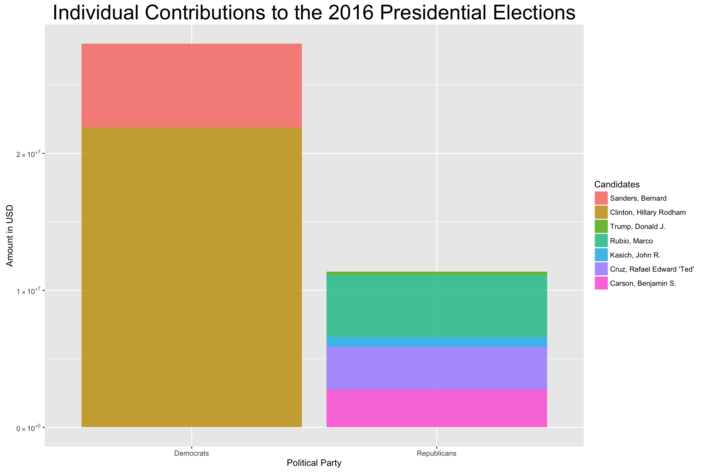
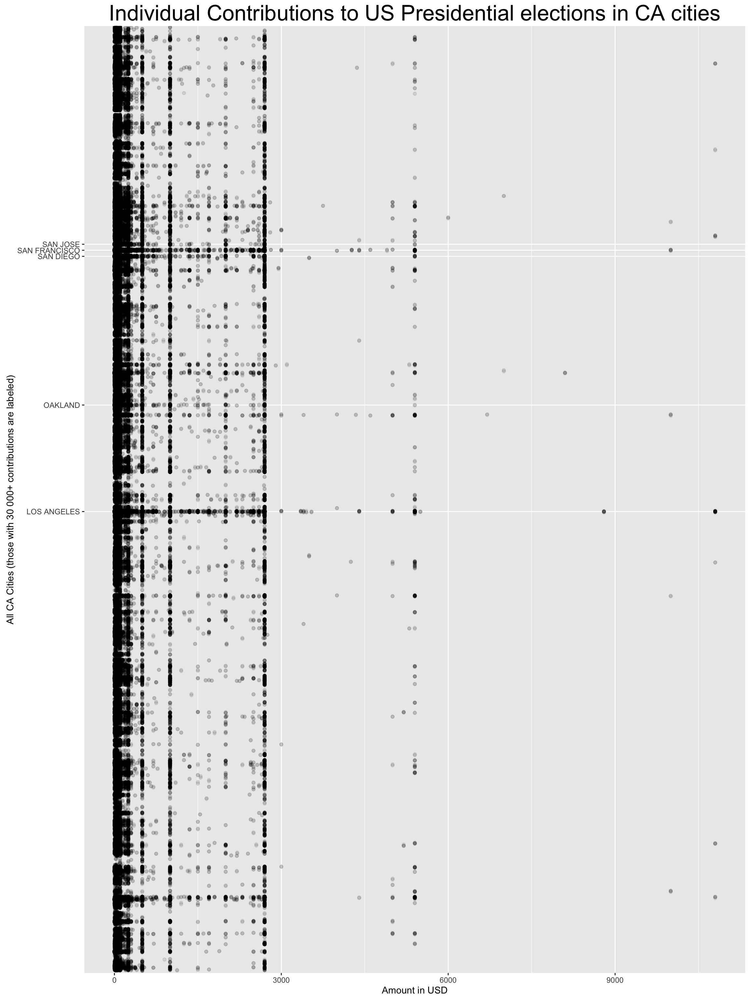
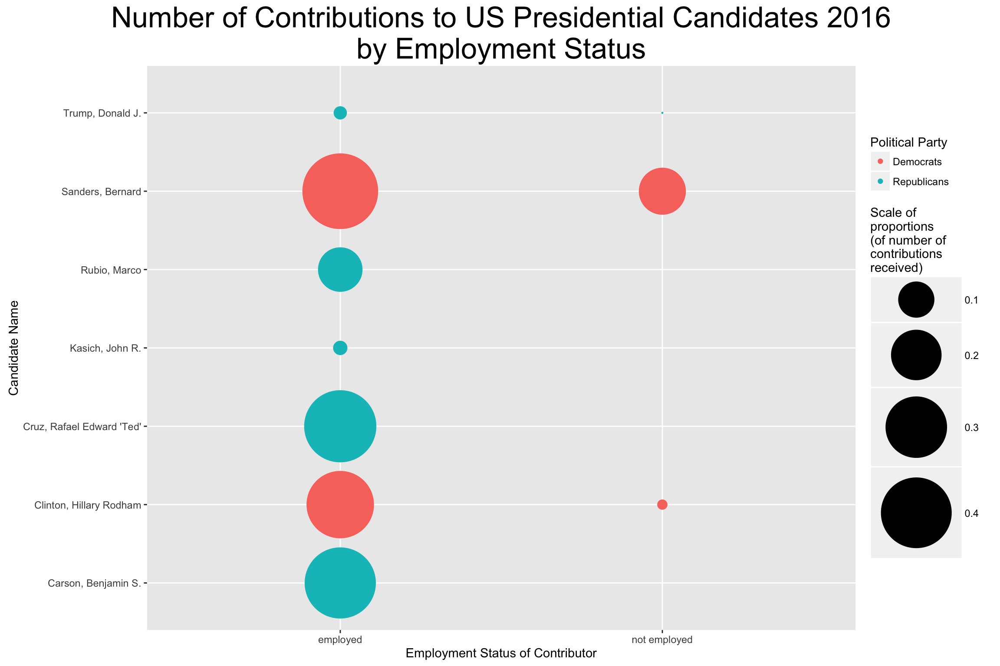

# presidential_dollars
An exploratory data analysis of the 2016 individual contributions to the US presidential election campaign.

## Introduction
I’m currently spending my time in the USA, and it’s (pre-)election time! Having a memebership to a 24h gym gets me exposed to a massive amount of politics on TV while I’m doing my time on the crosstrainer or even when I’m just changing in the dressing room. It’s February, the elections are in November, but there is a near-constant broadcast of candidates battling each other on CNN.

I’m impressed and surprised about this omnipresence of the elections on TV, already so early on. And I’m concerned about the rudeness that these debates often display. Politics in Europe are different. They’re not golden, nope. And there are insults and dirty tricks played also there. But here in the US there’s a level of “attack”, “aggression” and “god” in the talks, that I am thoroughly not used to. :/

One of the times while in the dressing room, I got stuck watching the TV talk about Dollars per Vote, and found this comparison very interesting. Some candidates spend very little money as compared to others in absolute, and yet in the end some end up spending still more money per vote received.

Now, my analysis will not deal with this comparison, since the ballots have not been cast yet (for a few months…), but I will make a preliminary analysis of the money that the presidential candidates were receiving from individual contributors in the run-up for the presidency.

## Ideas and Interests explored
1. Who got the most contributions? Which person, which party, which gender?

2. Which city contributed the most, and to whom (also: in relation to the number of citizens)

3. How many “NOT EMPLOYED” people contributed to the campaigns as compared to people with employment; Also: whom did the “NOT EMPLOYED” support the most?

## Final plots

### Contributions per candidate

In this graph displays how much money did each party and each candidate receive through individual contributions for the presidential elections in 2016.

It shows values only for those (main) candidates that are currently still running for the presidency in the primaries (as of 2016-03-02 and from here).

We can see the absolute amounts of money in USD that each of the two major political parties in the US received through individual contributions.

It is immediately obvious, that the democratic party obtained more than twice the amount of contributions than the republican party managed to lucrate.

The contributions are further subdivided to display the amounts that each individual candidate received.

Here Hillary Clinton sticks out with an amazingly big sum of contribution-money received. She alone got more Dollars than all the other candidates combined.

### Contributions per city

The graph shows all contributions to the candidates of the 2016 presidential elections, arranged by cities in California. The 5 cities where the highest number of contributions were given are labeled on the y-axis.

While most of these cities are also among the 5 most populous cities in CA, Oakland holds only the 8th place in that ranking. This means that it has an unusually high ratio of contributions per capita.

Another interesting feature of this graph are the clear vertical lines. These lines denote most likely full-number-amounts and/or contribution-limits defined by law.

### Contributions per employment status

This graphs gives some insight as to which candidates of the 2016 presidential elections did people without employment contribute to.

While most individual contributions come from people with employment, only three candidates received a significant amount of money from people who declared themselves as NOT EMPLOYED. These are:

1. Sanders, Bernard
2. Clinton, Hillary Rodham
3. Trump, Donald J.

It is interesting to see that most of the contributions of this sector of society went to the Democrats, and yet again the largest part to Sanders, Bernard.

Many college and university students are most likely counted among the NOT EMPLOYED. Sanders, Bernard is advocating free tuition for public colleges and universities, and enjoys high popularity among students. This might explain the large number of individual contributions received from people that are “unemployed”.
